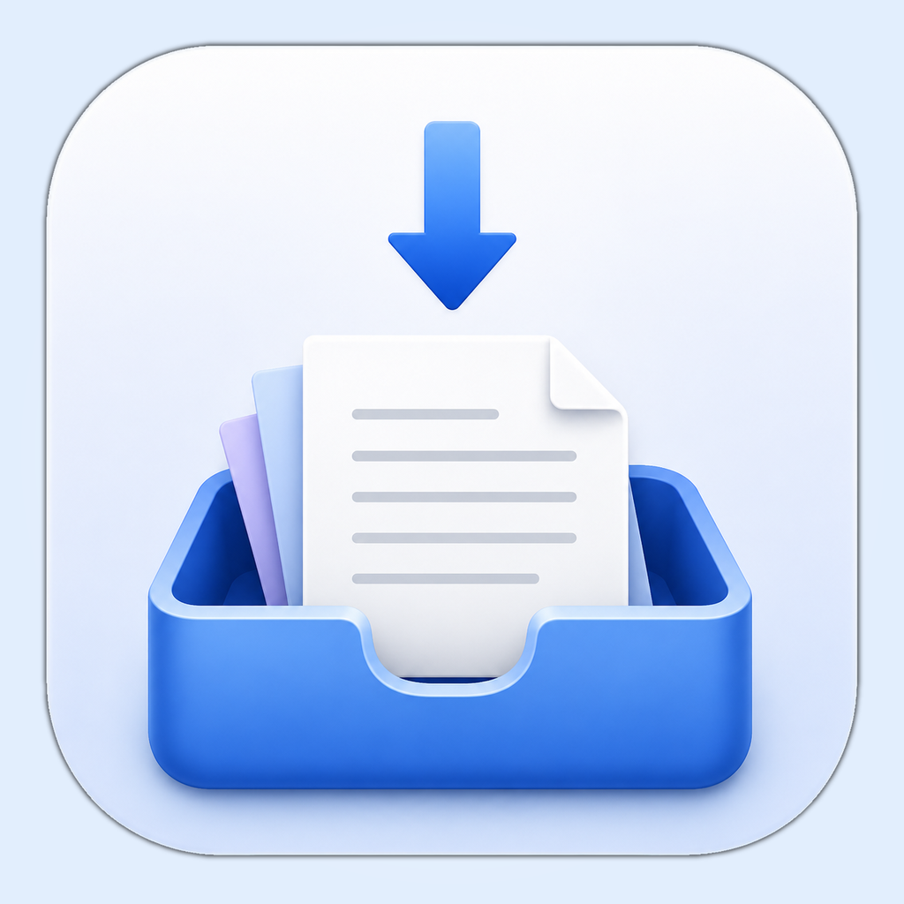
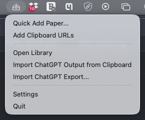
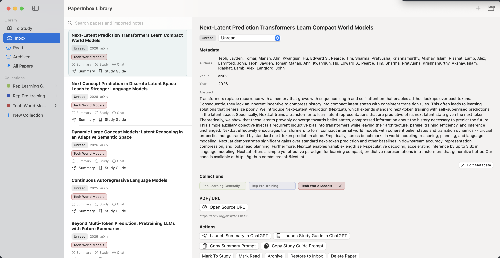
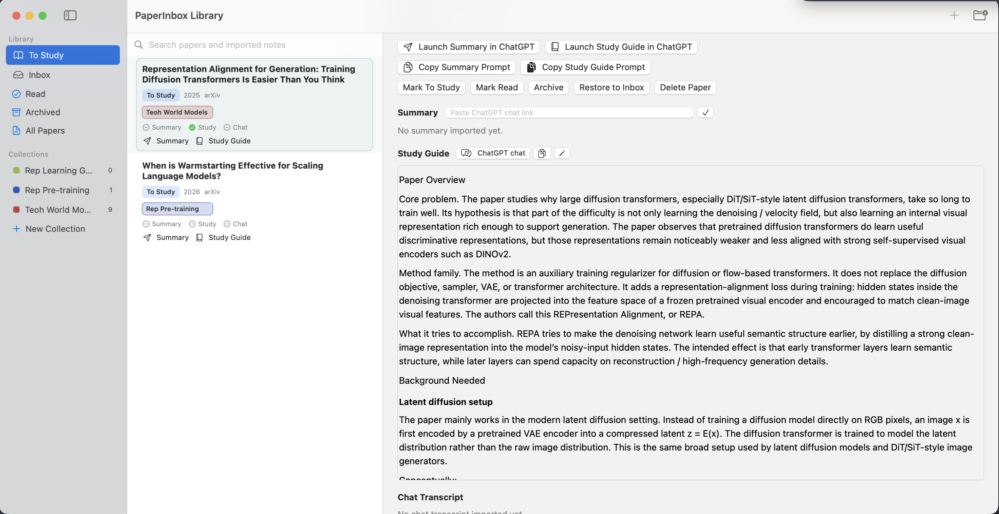
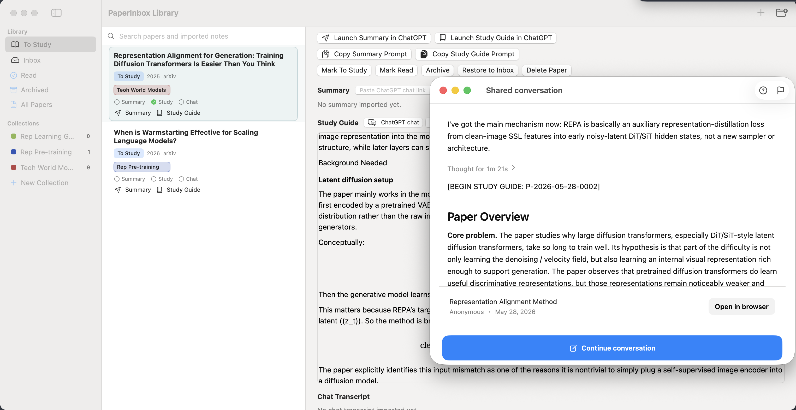

# PaperInbox

<p>
  
</p>

PaperInbox is a native macOS menu-bar app for managing papers you want to read, summarize, and discuss with ChatGPT. It keeps a local library of PDFs and paper URLs, lets you organize papers into collections, launches ChatGPT with structured prompts, and imports ChatGPT summaries or study guides back into the paper card.

Note that this doesn't use API credits and instead utilizes your ChatGPT desktop app. As such, it requires a ChatGPT subscription and the desktop app to be downloaded. 

## What It Does

- Captures papers from PDFs, single URLs, or a clipboard full of paper links.
- Looks up metadata for arXiv/DOI/web URLs when possible.
- Organizes papers into `To Study`, `Inbox`, `Read`, `Archived`, and custom collections.
- Supports colored collection tags and drag-and-drop assignment.
- Supports multi-select paper dragging into collections or between `Inbox` and `To Study`.
- Generates summary and study-guide prompts for ChatGPT.
- Imports wrapped ChatGPT output from the clipboard.
- Renders imported Markdown and LaTeX/math in the paper detail view.
- Saves ChatGPT conversation links for summaries and study guides.

## Screenshots

<p>
  
</p>

PaperInbox runs from the macOS menu bar, keeping library access, quick add, clipboard URL import, ChatGPT output import/export, settings, and quit actions close at hand.

<p>
  
</p>

The library combines paper triage, metadata, collection tags, source links, and ChatGPT actions in a single native window.

<p>
  
</p>

Imported summaries and study guides render inside the paper card with Markdown and LaTeX/math support.

<p>
  
</p>

Paper cards can keep ChatGPT conversation links alongside imported summaries and study guides.

## Basic Workflow

1. Launch PaperInbox.
2. Use the menu-bar inbox icon to open the library or add papers.
3. Add papers by dragging in PDFs, adding a URL, or using `Add Clipboard URLs`.
4. Triage papers in `Inbox`, then drag papers into `To Study` or collections.
5. Open a paper card and launch a summary or study-guide prompt in ChatGPT.
6. Paste the ChatGPT response back through `Import ChatGPT Output from Clipboard`.
7. Read the rendered summary/study guide inside the paper card.

## Using The App

PaperInbox runs as a menu-bar app. After launch, look for the small inbox icon in the macOS menu bar.

The menu-bar actions are:

- `Open Library`: opens the main library window to `To Study`.
- `Quick Add Paper...`: opens the add-paper dialog.
- `Add Clipboard URLs`: scans the clipboard for URLs and imports paper links. If arXiv links are present, it imports those paper links and ignores code/website links.
- `Import ChatGPT Output from Clipboard`: imports PaperInbox-wrapped summaries and study guides.
- `Settings`: opens app settings.

In the library window:

- `To Study` is the default landing view.
- `Inbox` contains newly added unread papers.
- Drag papers onto `To Study` or `Inbox` to change their status.
- Create collections in the sidebar and drag papers onto them.
- Command-click or Shift-click paper rows to select multiple papers, then drag the group into a collection or status.
- Right-click a collection to rename or delete it.
- Open a paper card to inspect metadata, collections, source links, prompts, summaries, study guides, and saved ChatGPT links.

## ChatGPT Output Import

PaperInbox expects ChatGPT summaries and study guides to preserve the wrappers included in the generated prompt, such as:

```text
[BEGIN PAPER SUMMARY: P-YYYY-MM-DD-NNNN]
...
[END PAPER SUMMARY: P-YYYY-MM-DD-NNNN]
```

or:

```text
[BEGIN STUDY GUIDE: P-YYYY-MM-DD-NNNN]
...
[END STUDY GUIDE: P-YYYY-MM-DD-NNNN]
```

Copy the full wrapped ChatGPT response, then choose `Import ChatGPT Output from Clipboard` from the menu-bar app.

## Installation

Clone the repository:

```sh
git clone <github-repo-url>
cd paper_inbox_project
```

Check that Swift is available:

```sh
swift --version
```

PaperInbox is a native macOS app. You need either full Xcode or Apple's Command Line Tools installed. This repo currently includes a manual app-bundle build path that works with Command Line Tools.

Build the app bundle:

```sh
make app
```

That creates:

```text
Build/PaperInbox.app
```

Run it from the build folder by opening `Build/PaperInbox.app`, or install it into Applications:

```sh
cp -R Build/PaperInbox.app /Applications/
```

Then launch:

```text
/Applications/PaperInbox.app
```
## Development

The local build path that works in this environment is:

```sh
make app
```

You can also typecheck the app and core sources without building a bundle:

```sh
make typecheck
```

On a machine with full Xcode or a repaired Command Line Tools install, the SwiftPM commands should be:

```sh
swift build
swift test
```

On this machine, `swift test` currently fails before compiling project code because `xcrun --sdk macosx --show-sdk-platform-path` fails for the active Command Line Tools installation.

## Current Limitations

- No Xcode project scaffolding yet.
- No automatic prompt paste via Accessibility.
- No automatic PDF attachment to ChatGPT.
- ChatGPT export ZIP import is planned but not implemented.
- Prompt templates are currently code-defined rather than editable in the UI.
- Open-at-login setting is not implemented yet.
